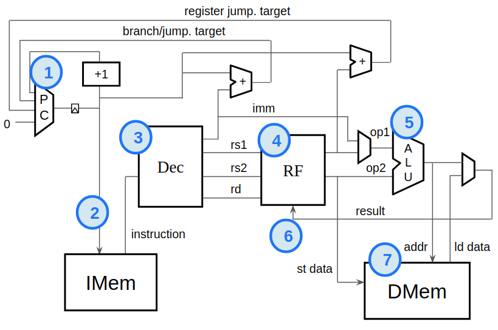

# RISC_V
Desenvolvimento de um simples processador RISC-V

### Instruções implementadas
| Inst  | Meaning                                   | Condition Expression             |
| ----- |:------------------------------------------|:---------------------------------|
|ADD    | Sum                                       |                                  |
|ADDI   | Immediate sum                             |                                  |
|BEQ    | Branch if equal                           | x1 == x2                         |
|BNE    | Branch if not equal                       | x1 != x2                         |
|BLT    | Branch if less than                       | (x1 < x2) ^ (x1[31] != x2[31])   |
|BGE    | Branch if greater than or equal           |  (x1 >= x2) ^ (x1[31] != x2[31]) |
|BLTU   | Branch if less than, unsigned             | x1 < x2                          |
|BGEU   | Branch if greater than or equal, unsigned | x1 >= x2                         |
|LUI|		| imm[31:12] CONCAT 12'b0|
|AUIPC|		| pc + imm|
|JAL|		| 
|JALR|		|
|LB||		|
|LH|		|
|LW|		|
|LBU|		|
|LHU|		|
|SB|		|
|SH|		|
|SW|		|
|SLTI|		|
|SLTIU|		|
|XORI|		| x1 | imm (valor imediato)|
|ANDI|		| x1 & imm (valor imediato)|
|SLLI|		| x1 << imm[5:0]|
|SRLI|		| x1 >> imm[5:0]|
|SRAI|		|
|SUB|		| x1 - x2|
|SLT|		|
|SLTU|		| 
|XOR|		| x1 ^ x2|
|SRL|		| x1 >> x2[4:0]|
|SLL|		| x1 << x2[4:0]
|SRA[64:0]| 	| (32 * { x1[31] } CONCAT x1) >> x2[4:0]|
|OR| 		| x1 \| x2|
|AND|		| x1 & x2|
|ORI|		|

### Não implementado
  *  Controlador E/S
  *  Interrupções
  *  System Timers
  *  Caches

## Cursos 
  Building a RISC-V CPU Core - https://learning.edx.org/
  
## Plataforma 
  Makerchip - https://makerchip.com
  Através dessa plataforma será possível desenvolver em T-Verilog, verificar erros que possivelmente serão ocorridos, criar simualções e visualizar graficamente suas ligações e componentes gerados.
